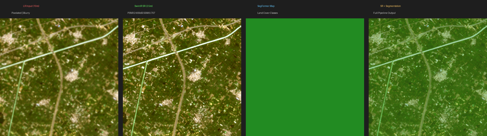
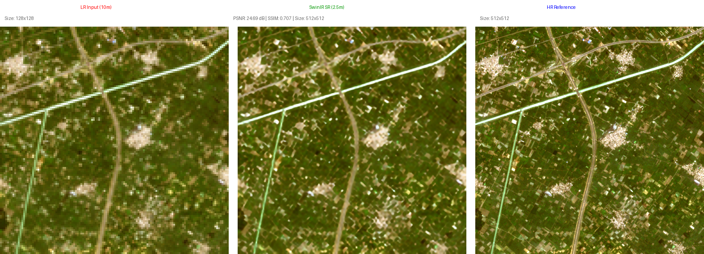
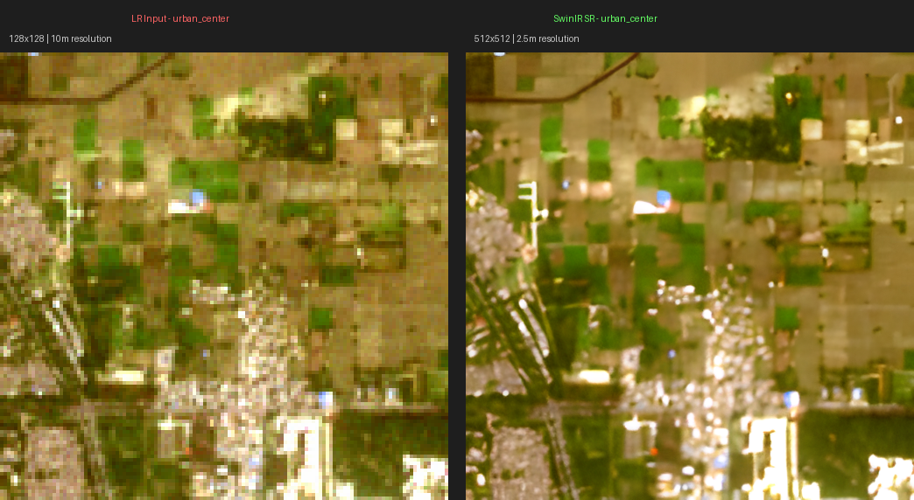
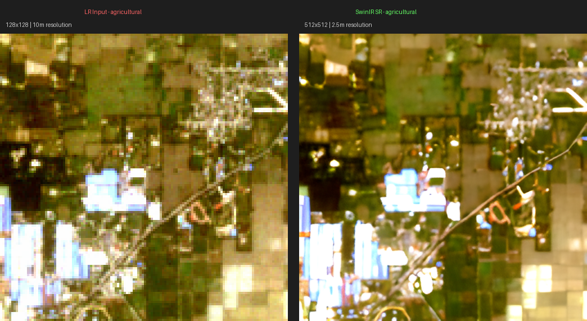
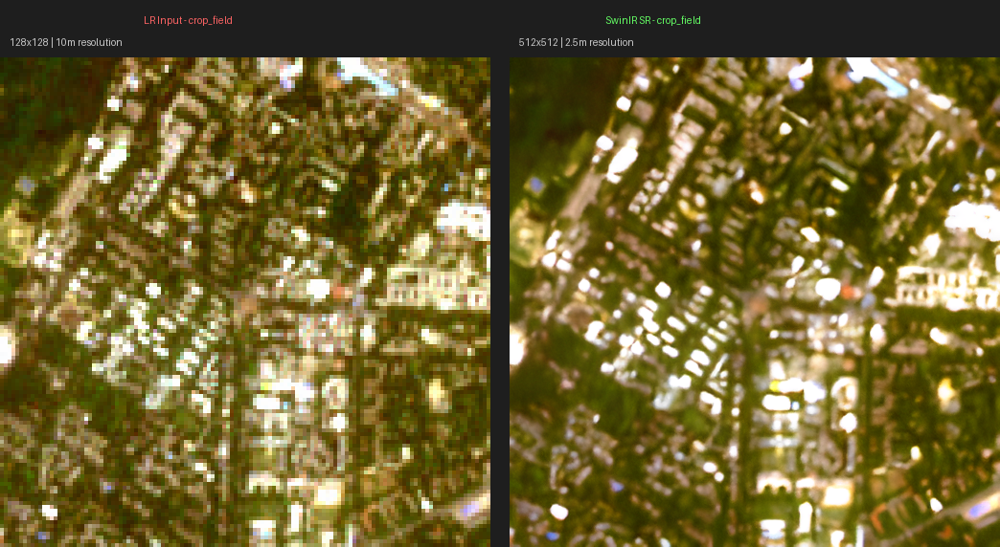
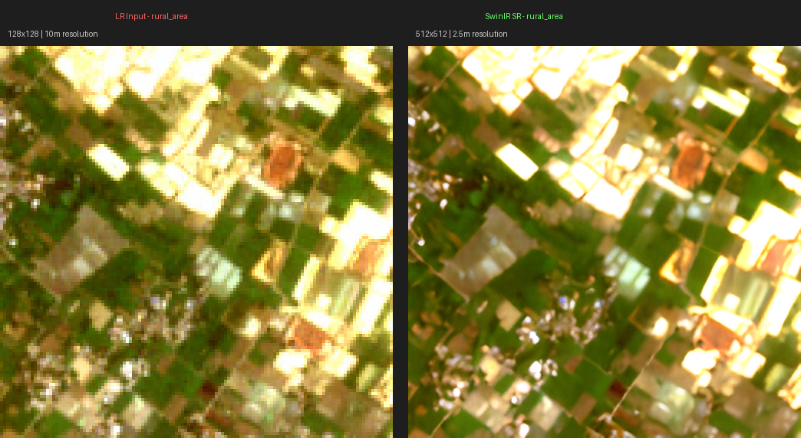
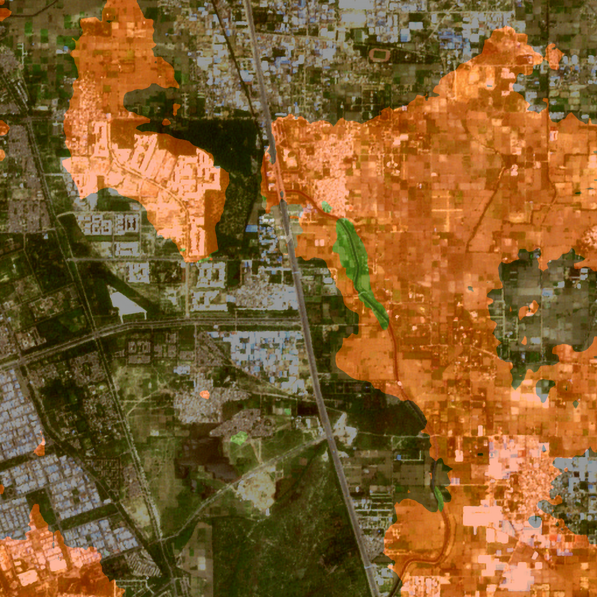

# Deep Learning Super Resolution Mapping (SRM)
### Sentinel-2 Satellite Imagery Enhancement using SwinIR + SegFormer

## Problem Statement
**ID: 26142** | Organization: **NTRO (National Technical Research Organisation)**

Medium-resolution satellite imagery (10-30m) is widely used but insufficient for fine-scale analysis such as identifying small buildings, narrow roads, field boundaries, or localized damage assessment.

## Our Solution
A deep learning based super resolution framework that enhances Sentinel-2 satellite imagery from **10m → 2.5m resolution (4× upscaling)** using SwinIR Transformer + GAN training.

---

## Results

### LR vs SR vs HR Comparison

### Multiple Terrain Types
| Urban Center | Agricultural |
|---|---|
|  |  |

| Crop Field | Rural Area |
|---|---|
|  |  |

### Segmentation Maps

---

## Evaluation Metrics

| Metric | Value |
|---|---|
| **PSNR** | 24.66 dB |
| **SSIM** | 0.7386 |
| **LPIPS** | 0.3718 |
| **Training Time** | 15 min 41 sec |
| **Loss Improvement** | 66.4% |
| **Scale Factor** | 4× (10m → 2.5m) |

---

## Model Architecture